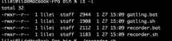
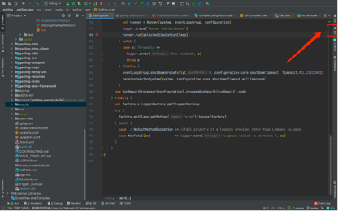
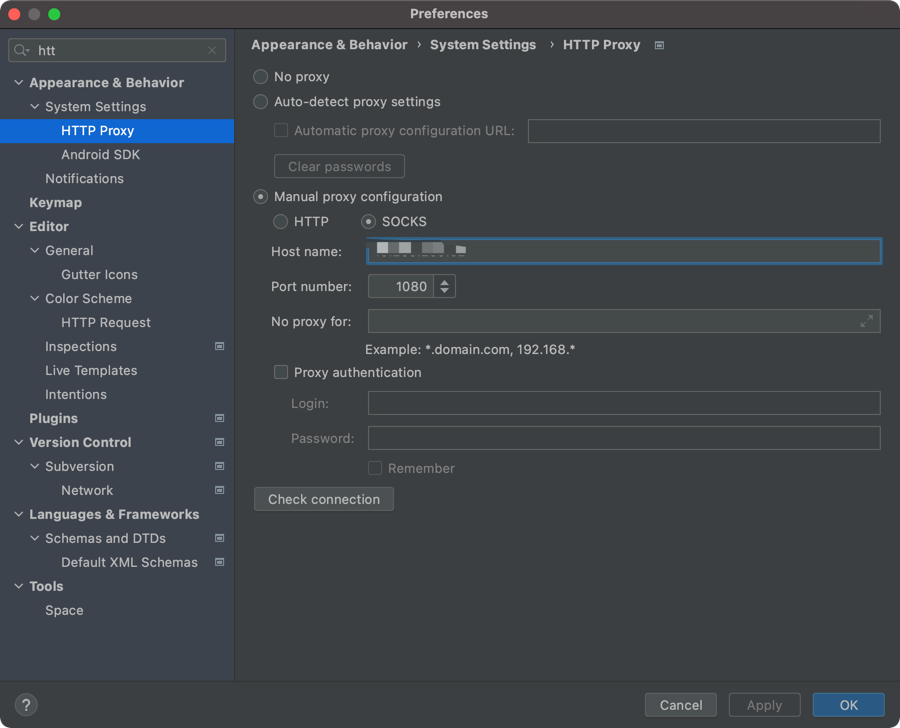
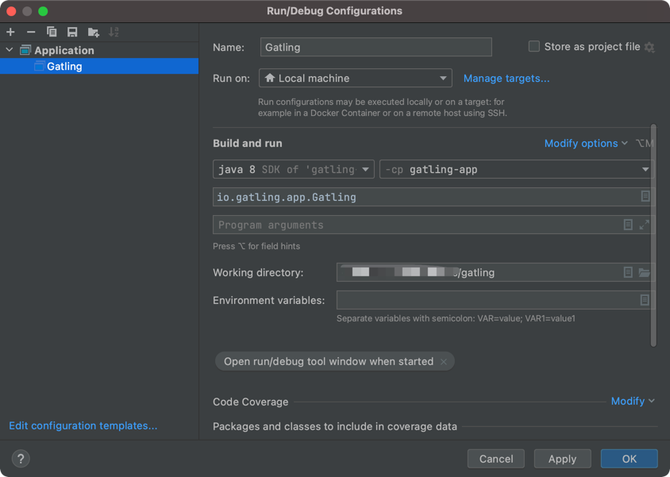
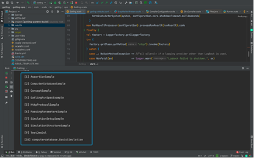

# Gatling  

## Gatling是什么 ?

Gatling is a load test tool.
It officially supports HTTP, WebSocket, Server-Sent-Events and JMS.

## 底层技术

Gatling is developed in Scala and built upon :

* [Netty](https://netty.io) for non blocking HTTP
* [Akka](https://akka.io) for virtual users orchestration
...

## 文档和社区

Read the [documentation](https://gatling.io/docs/current/).

Join the [Gatling User Group](https://groups.google.com/forum/#!forum/gatling).

Found a real bug? Raise an [issue](https://github.com/gatling/gatling/issues).

#源码编译、调试
##本地环境
以下需要本地安装并配置环境变量
1.	Sbt
      版本：1.4.5
2.	Scala
      版本：2.13.4
3.	在idea中安装scala插件
4.	JDK 1.8版本
5.	本地配置java、scala、sbt环境变量

## 编译与发布
1.	首先，从github上clone下gatling的源码
      git clone https://github.com/LiRuiHanChen/gatling.git
      git clone https://github.com/LiRuiHanChen/gatling-highcharts-master.git
2.	进入gatling工程目录，执行sbt compile
3.	执行sbt publishLocal（发布到ivy仓库）
4.	第三步成功后，进入gatling-highcharts项目目录，执行sbt compile等待成功后，执行sbt publishLocal
5.	执行成功之后在本地目录：
      /root/.ivy2/local/io.gatling.highcharts/gatling-charts-highcharts-bundle/3.5.0-SNAPSHOT/zips
    

## 运行与调试
1.	Idea安装Scala插件
2.	按照sbt方式导入gatling和gatling-highcharts项目
3.	导入方式无误的话，项目会自动构建(构建时间比较长)。为了加快构建需要在idea中设置代理，如果速度依旧不可观，可设置本地网络的全局代理。
    
    
4. debug || run
   
5.	以上步骤配置完成后构建项目
6.	将GatlingFiles类中GalingHome修改为 可执行文件的绝对路径（/xx/xx/.ivy2/local/io.gatling.highcharts/gatling-charts-highcharts-bundle/3.5.1/zips/gatling-charts-highcharts-bundle-3.5.1）
7.	在源码编译目录下执行sh bin/gatling.sh(生成.class文件)
8.	出现如下图显示代表启动成功
    

